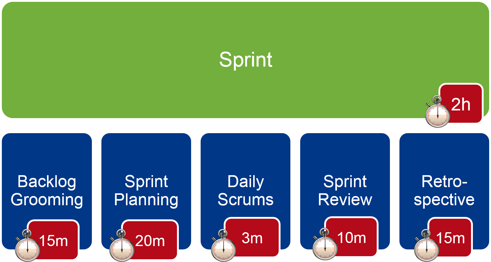
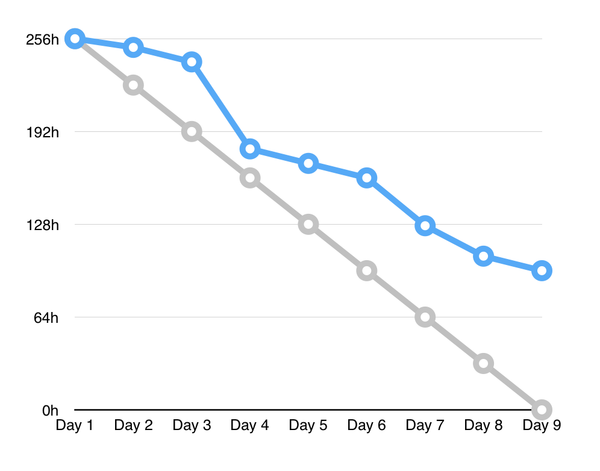
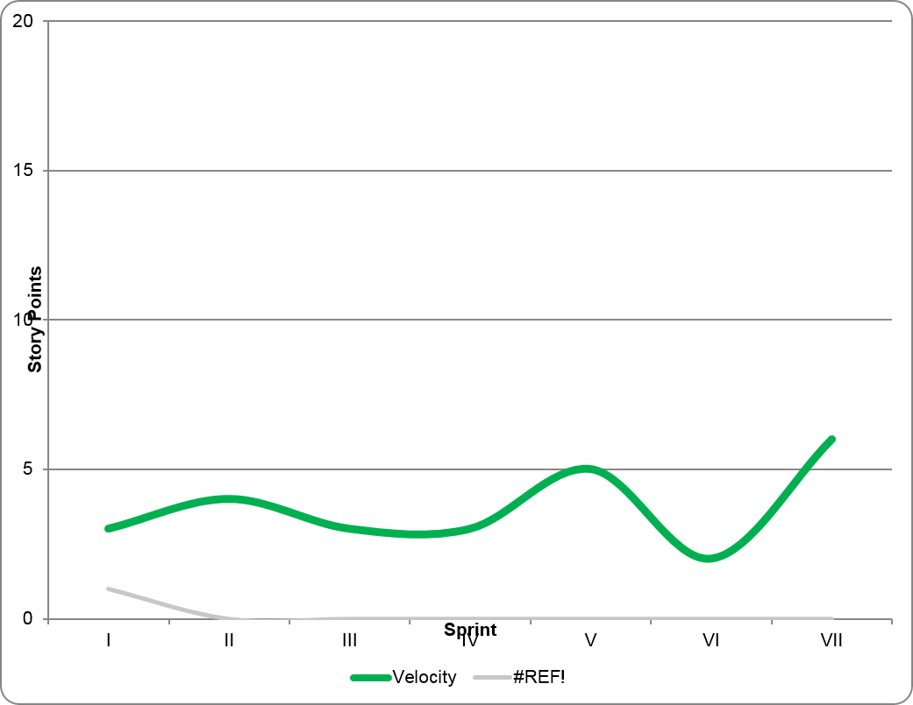
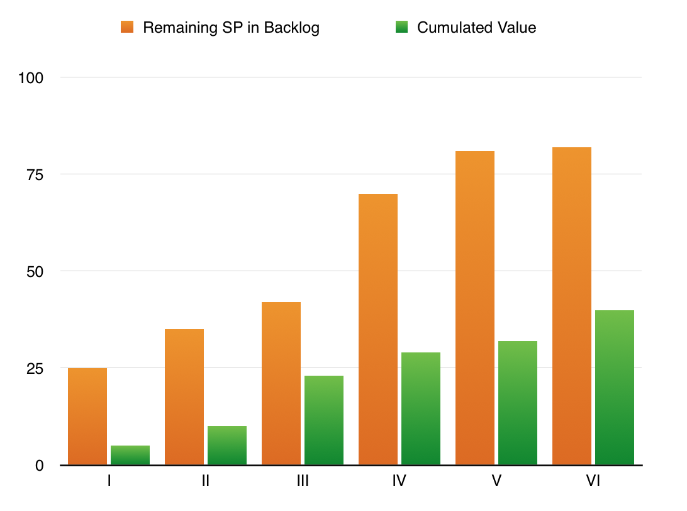

<!-- .slide: data-background="img/background_title.jpg" data-state="intro" class="center" -->
 <!-- .element: class="cc_logo" -->
## Scrum for developers - Sprint 1 <!-- .element: class="heading" -->
----
### Scrum Fundamentals <!-- .element: class="heading" -->

---

<!-- .slide: class="center" style="text-align: center"-->

---

<!-- .slide: style="font-size: 0.7em" -->
## Agenda
* Introduction
 * Scrum Roles
 * User Story & Backlog
* Meetings
 * Refinement
 * Planning I+II
 * Daily
 * Review/Demo
 * Retrospective
* Estimation
 * Story Points
 * Planning Poker
* Artifacts
 * Definition of Done
 * Task Board
 * Sprint Burndown
 * Velocity Chart

---

# Introduction
### Scrum Roles
### Story & Backlog

***

## Scrum Roles
 <!-- .element: style="width: 700px;" -->

***

## User Story

A **user story** is a ...
* ... description of a requirement ...
* ... in the everyday language of the end user ...
* ... that captures what a user does as part of his or her job function.

> A user story captures the **"who"**, **"what"** and **"why"** of a requirement in a **simple**, **concise** way.

***

## Backlog

* The **product backlog** is an ordered (prioritized) list of requirements.
* The product owner is responsible for the product backlog.
* The product backlog "lives" (priorities change, new stories added, irrelevant stories removed).
* The sprint backlog contains the stories selected for one sprint.

---

# Meetings
### Refinement
### Planning I+II
### Daily
### Review/Demo
### Retrospective

***

### Scrum events and time boxes (Real World)

***

### Scrum events and time boxes (Training)

***

## Backlog Refinement

* Product owner presents product backlog to the development team.
* Backlog items are discussed, revised, reviewed.
* Development team estimates backlog items.

**Goals:** Development team builds understanding of future requirements.

***

## Sprint Planning - Part I

* PO + development team
* PO presents user stories and priorities
* Development team and PO discuss user stories and pin down acceptance criteria
* Development team makes a **forecast**, what functionality it plans to achieve during the next sprint

***

## Sprint Planning - Part I
* Development team only
* Team breaks down stories in smaller tasks
* Develop necessary design/architecture
* Sketch the solution on the wall, flipchart, etc.
* Draw GUI mock-ups (if not already done so by UX)
* Do some research or look in the code base if necessary
* Or time-box some research later, have a later task as a place holder

***

## Sprint Review/Demo

* Purpose?
 * Development Team: Experience competence
 * Product Owner: Get feedback from **stakeholders**
* Product Owner
 * Communicates current status and makes forecast on future features
* Team
 * Presents the done stories
 * Reports noteworthy events during the sprint
* Stakeholder
 * Reacts on new information

***

<!-- .slide: style="font-size: 0.8em" -->
## Retrospective

Prime Directive: "Regardless of what we discover, we must understand and truly believe that everyone did the best job he or she could, given what was known at the time, his or her skills and abilities, the resources available, and the situation at hand."

* 5 Phases (Book: Agile Retrospectives, Ester Derby & Diana Larson) <!-- .element: style="margin-bottom: 0" -->
 1. Setting The Stage
 2. Gathering Data
 3. Generate Insights
 4. Decide What to Do
 5. Closing

* Focus rather on system & process instead of individuals

* Add results to the Sprint Backlog, make somebody responsible

---

# Estimation
### Why?
### What?
### How?

***

<!-- .slide: class="center" style="text-align: center"-->
## Why estimate?

***

## Story Points

* Estimates are done in releative, unitless values
* You estimate only in relations, not absolutely
 * Story points stay constant over time
 * The teams velocity can change
 * Story points normalize skill level
 * Story points normalize done level
* Estimation can be done:
 * By Planning Poker (for few or new stories)
 * By Affinity Estimation (for a complete product backlog)
 * By Magic Estimation (similar to Affinity Estimation)

***

## Planning Poker

1. Product Owner presents and reads a new story
2. Every Development Team member chooses a card (1,2,3,5,8,13,20,40,100,?)
3. When everybody is ready, all cards are revealed
4. Are all cards in range of three (1-3, 2-5, 3-8, 5-13,...)?
 * If yes, continue at step 1
 * If no, Players with highest and lowest cards discuss their views for a moment. Then continue with step 2.

---

# Scrum Artifacts
### Definition of Done
### Task Board
### Sprint Burndown
### Velocity Chart

***

## Definition of Done

* Criteria for a software that is potentially shippable
* Can you ship you software after the sprint? If not, what is missing?
* Use the Definition of Done as a checklist during Sprint Planning II
* Make the DoD visible (nail it next to the task board)

***

## Task Board

* Task status and responsibility  <!-- .element: style="width:400px; float: right; margin-left: 10px" -->
* Continuously updated: New Tasks are added as they are discovered
* Reestimate remaining effort every day (up or down)

***

## Sprint Burn-Down Chart

* Daily summation of work remaining in Sprint  <!-- .element: style="width:400px; float: right; margin-left: 10px" -->
* Often goes up before it goes down
* Post for high visibility
* Reflects team intuition
* Not for anyone but the development team

***

## Velocity

* Used by the Product Owner to provide forecasts  <!-- .element: style="width:400px; float: right; margin-left: 10px" -->
* Used by the Development Team to gauge how much work to pull in a Sprint Planning meeting

***

## Product/Release Burn-Down Chart

* A Burn-Down chart shows  <!-- .element: style="width:400px; float: right; margin-left: 10px" -->
 * What has been achieved
 * What is left to do
* For a release, it shows remaining features to complete for a release
