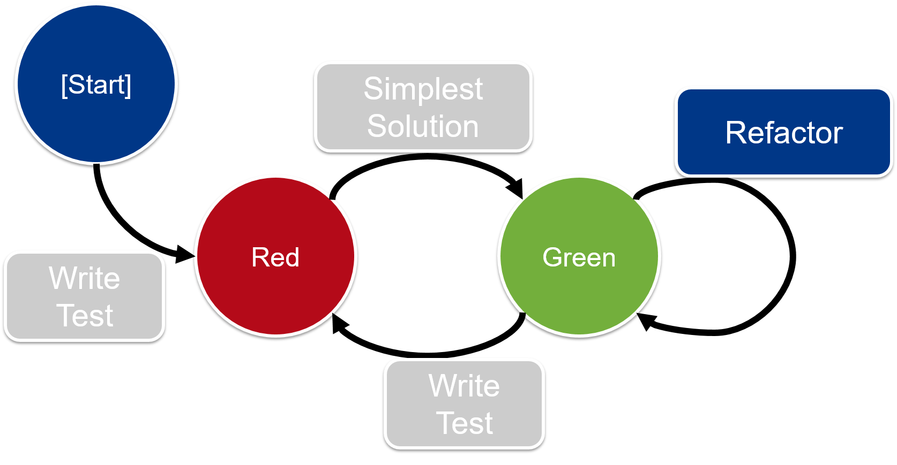

<!-- .slide: data-background="img/background_title.jpg" data-state="intro" class="center" -->
 <!-- .element: class="cc_logo" -->
## Scrum for developers - Sprint 3 <!-- .element: class="heading" -->
----
### Test Driven Development <!-- .element: class="heading" -->

---

### Agenda
* The three rules of TDD
* TDD Cycle
* Example Story
* Live coding
* Definition of Done

---

### The three rules of TDD

- You are not allowed to write any production code unless it is to make a failing unit test pass.
- You are not allowed to write any more of a unit test than is sufficient to fail; and compilation failures are failures.
- You are not allowed to write any more production code than is sufficient to pass the one failing unit test.
---

### TDD Cycle

---

### Example Story

As a library manager I want a fee to be charged for a rented book after a given
time, so that the borrowers don't keep the books for too long.

Acceptance criteria:

* Until four weeks (28 days) --> 0 €
* In the fith week (29 - 35 days) --> 1€
* In the sixth week (35 - 42 days) --> 2€
* Every week after that (>=43 days) --> 2€ + 3€ for every additional week

---

**Definition of Done**
* code is developed test first
* automated database migration works <!-- .element: class="former" -->
* release notes are updated <!-- .element: class="former" -->
* release artifacts are deployed in artifactory <!-- .element: class="former" -->
* version number is incremented <!-- .element: class="former" -->
* stories are developed in (feature) branches <!-- .element: class="former" -->
