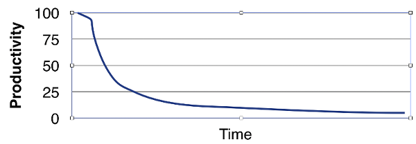

<!-- .slide: data-background="img/background_title.jpg" data-state="intro" class="center" -->
 <!-- .element: class="cc_logo" -->
## Scrum for developers - Sprint 5 <!-- .element: class="heading" -->
----
### Code Quality <!-- .element: class="heading" -->

---

### Expectations

- Get a nose for smelling code
- Write readable code
- Refactor existing code when needed, using IntelliJ instruments

---

### Clean code – why does it matter?

* Maintenance is by far the biggest part of the application development lifecycle
* Good code is essential for maintainability
* Effects of bad code
    * High maintenance cost and work
    * Productivity on serving business needs goes down
   
     

     
---

### Clean code attitude

- Feel responsible for your code.
- Be open for advice.
- Make yourself write clean code.
- Also improve/fix legacy code where advisable
.
  “Leave the campground better than you found it”
     
---

Clean Code
 - A Handbook of Agile Software Craftsmanship
 - Robert C. Martin

(ISBN-13: 978-0-13-235088-4)

A great set of advice/rules for writing good code

<!-- LeBlanc’s law: “Later equals never”
 (“Later I will improve my code!”) -->

---

### Live Coding

  
---

### Clean code – measure code quality

---

**Definition of Done**
* code is maintainable by third persons
* sonar is green: no blockers or criticals, test coverage > 60 %
