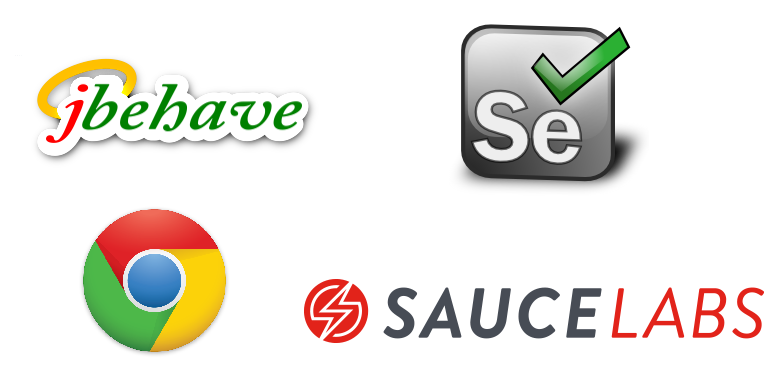

<!-- .slide: data-background="img/background_title.jpg" data-state="intro" class="center" -->
 <!-- .element: class="cc_logo" -->
## Scrum for developers - Sprint 4 <!-- .element: class="heading" -->
#### Acceptance Test Driven Development (ATDD)
 <!-- .element: class="heading" -->

---

### Agenda
* Why should we do acceptance testing?
* How can we do it?
* Definition of Done

---
<!-- .slide: data-background="img/background_title.jpg" class="center" -->
### Why should we do ATDD? <!-- .element: class="heading" -->

---

### Communication Problems

* Requirements are misunderstood
* Obvious things are not obvious
* Wrong assumptions

* Specification
  * does not reflect implementation
  * has gaps and is inconsistent

* The most important information in the business specification is ...

### The author‘s phone number <!-- .element: class="heading" -->

---

### Fail fast

* Requirements are not met every time
* Gain feedback as fast as possible
* Not met requirements or bugs should be discovered **before** a feature comes into production!

---

## What if ... ?

<!-- tests are specified in business domain terms -->
* PO && Devs would speak the same language?

* PO could define his specification beforehand - in code!?

* Devs could reduce explorational testing by automated tests?

---
<!-- .slide: data-background="img/background_title.jpg" class="center" -->
### How can we do it? <!-- .element: class="heading" -->

---

### Worblehat ATT Technology Stack

---
<!-- .slide: data-background="img/background_title.jpg" class="center" -->
#### Let us dig into some examples ... <!-- .element: class="heading" -->

---

### Example Story #1

As a library manager, I want to add books through the website, 
so that I can add books to the library.

Acceptance criteria:

* A book can be added with the following properties: 
isbn, author, title, edition, year
* The added book is persisted and can be found in the book list.

---

### Example Story #2

As a user, I want to borrow an interesting book, 
so that I can take a book home for further reading.

Acceptance criteria:

* With his e-mail, a user is able to borrow a book by isbn.
* A user could only borrow one book by isbn. An error message 
should be shown, when he tries to borrow the same book as well.

---

### Acceptance Test Stories  do reflect User Stories

* User Stories
  * Who? What? When?
  * Encourage discussion

* Acceptance Test Story
  * Result of the discussion
  * Common understanding of all participants  (PO, Dev, QA, ...)

---

### Definition of Done

**Definition of Done**
* acceptance tests get executed
* acceptance tests are green (blue)
