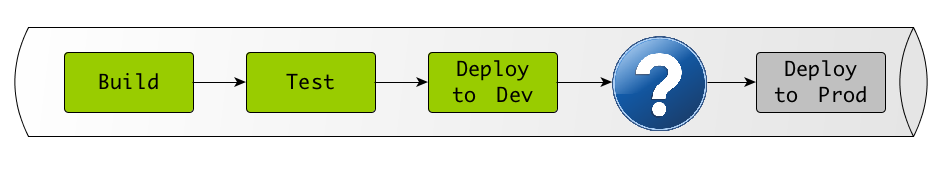
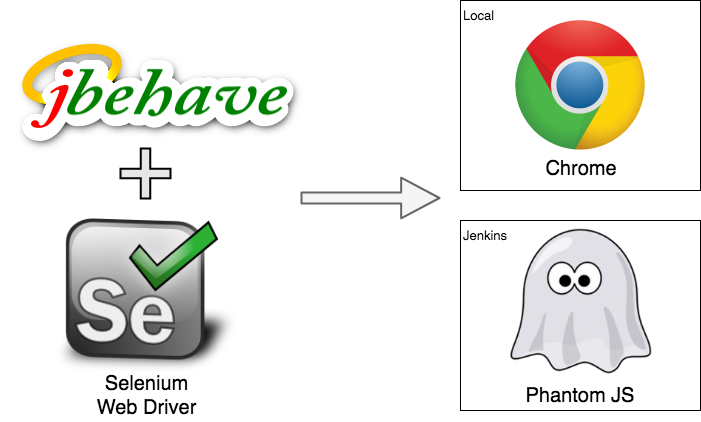

<!-- .slide: data-background="img/background_title.jpg" data-state="intro" class="center" -->
 <!-- .element: class="cc_logo" -->
## Scrum for developers - Sprint 4 <!-- .element: class="heading" -->
#### Acceptance Testing
 <!-- .element: class="heading" -->

---

### Agenda
* Why should we do acceptance testing?
* How can we do it?
* Demo
* Definition of Done

---
<!-- .slide: data-background="img/background_title.jpg" class="center" -->
### Why should we do Acceptance Testing? <!-- .element: class="heading" -->

---

### Communication Problems

* Requirements are misunderstood
* Obvious things are not obvious
* Wrong assumptions

* Specification
  * does not reflect implementation
  * has gaps and is inconsistent

* The most important information in the business specification is ...

### The author‘s phone number <!-- .element: class="heading" -->

---

### Fail fast

* Requirements are not met every time
* Gain feedback as fast as possible
* Not met requirements or bugs should be discovered **before** a feature comes into production!

---

## What if?

<!-- tests are specified in business domain terms -->
* PO && Devs could share the same understanding?

* PO && Devs could define their specification beforehand and adapt it in code?

* Devs could reduce explorational testing by automated tests?

---

<!-- .slide: data-background="img/background_title.jpg" class="center" -->
### How can we do it? <!-- .element: class="heading" -->

---

## Executable Specification

* **Given**: Is a pre-conditioned state 

I have Kevin added as Facebook friend

* **When**: An actor interacts with the system 

I visit Kevin's Facebook profile and click the 'Remove from Friends' button

* **Then**: I have a measurable outcome

I don't find him in my friends list anymore

* Gherkin Syntax

---

### Executable Specifications  do reflect User Stories

* User Stories
  * Who? What? When?
  * Encourage discussion

* Executable Specification
  * Result of the discussion
  * Common understanding of all participants  (PO, Dev, QA, ...)

---

### Acceptance Test Driven Development (ATTD)

* User Stories and Executable Specification
* Define an Executable Specification / Gherkin Scenario before you code
* Focus the software development on the "green" of the Acceptance Tests

---

### Worblehat's Acceptance Test Suite

---

<!-- .slide: data-background="img/background_title.jpg" class="center" -->
#### Let us dig into one example ... <!-- .element: class="heading" -->

---

### Example Story #1

As a library manager, I want to add books through the website, 
so that I can add books to the library.

Acceptance criteria:

* A book can be added with the following properties: 
isbn, author, title, edition, year
* The added book is persisted and can be found in the book list.

---

### Definition of Done

**Definition of Done**
* acceptance tests get executed
* acceptance tests are green (blue)
